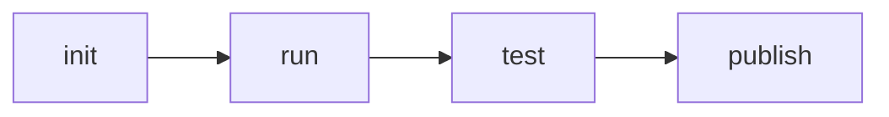
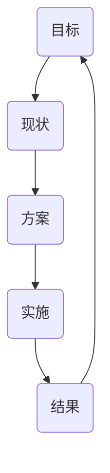

# 学习方法

## 参考链接
* https://www.w3.org/
* http://w3school.com/
* https://whatwg.org/
* https://scholar.google.com/
* https://developer.mozilla.org/
* https://docs.microsoft.com/
* https://developer.apple.com/

## 名词
* QCon：全球软件开发大会（ https://qcon.infoq.cn/2020/beijing/）
* Closure：闭包（ https://en.wikipedia.org/wiki/Closure_(computer_programming) ）


# 构建知识体系

## 参考链接

### 主要参考网站
* https://www.ecma-international.org/
* https://developer.mozilla.org/en-US/docs/Web
* https://whatwg.org/

### 涉及网址
* https://www.ecma-international.org/publications/files/ECMA-ST/ECMA-262.pdf
* https://www.w3school.com.cn/html/html_entities.asp
* https://www.w3.org/1999/xhtml/
* https://html.spec.whatwg.org/multipage/
* https://developer.mozilla.org/zh-CN/docs/Web/HTML/Element


## 参考名词
* XMind：思维导图软件（ https://www.xmind.cn/）
* DTD：Document Type Definition（ https://www.w3.org/TR/xhtml1/DTD/xhtml1-strict.dtd）
* Entity：实体（在 HTML 语境下就是 & 符后边的东西）
* ARIA：Accessible Rich Internet Applications（ https://www.w3.org/TR/html-aria/）
* Token：有效的输入元素
* Comment：注释
* WhiteSpace：空白符
* Line Terminator：行终止符
* Atom：原子
* Semantics：语义
* Runtime：运行时


## 其他有助于你理解的知识（选看）

* 计算机组成原理
* 操作系统
* 编译原理
* 学员给出的课上参考代码：
```
Array.prototype.map.call($0.querySelectorAll(‘code’), e => e.innerText).join(’\n’)

```

# 工程体系
## 参考链接：
* https://fed.taobao.org/blog/taofed/do71ct/fed-learning-quizzes-apply/?spm=taofed.blogs.blog-list.9.44fe5ac8p6qg66
* https://tools.ietf.org/html/rfc3986
* https://svn.apache.org/repos/asf/labs/webarch/trunk/uri/rev-2002/issues.html
* https://tools.ietf.org/
* https://github.com/spritejs/spritejs
* https://spritejs.org/#/


## 参考名词：
* UV：（Unique Visitor）独立访客，统计 1 天内访问某站点的用户数 (以 cookie 为依据)，如果清除了 cookies 或者更换设备访问，计数会加 1。按用户算的，比较真实一点。
* PV：（Page View）访问量, 即页面浏览量或点击量，在一定统计周期内用户每打开或刷新一个页面就记录 1 次。
* ctr：点击率（click-through rate）
* 判断用户活跃度：日活除以月活
* CICD：持续集成 (Continuous Integration) 和持续部署 (Continuous Deployment) 简称。
* SpriteJS：是跨平台的高性能图形系统，它能够支持 web、node、桌面应用和小程序的图形绘制和实现各种动画效果。
* 前端之巅：InfoQ 旗下关注大前端的技术社群
* 龙书：《编译原理》

# 工程体系(课上)
## 职业规划
## 职业发展
### 成就
> 业务型成就
* 业务目标
  * 理解公司业务的核心目标
  * 目标转化为指标
* 技术方案
  * 业务指标到技术指标的转化
  * 形成直面方案、完成小规模实验
* 实施方案
  * 确定实施目标、参与人
  * 管理实施进度
* 结果评估
  * 数据采集、数据报表
  * 向上级汇报
> 技术难题
* 目标
  * 公认的技术难点
* 方案与实施
  * 依靠扎实的编程能力、架构能力形成解决方案
* 结果
  * 线上监控

> 工程型成就
* 目标
  * 质量、效率
* 方案与实施
    * 规章制度
    * 库
    * 工具
    * 系统
* 结果
  * 线上监控

> 工具链
  * 工具链作用
  * 工具链分类
    * 脚手架
    * 本地调试
    * 单元测试
    * 发布
  * 工具链体系的设计
    * 版本问题
    * 数据统计


> 持续集成
* 客户端软件持续集成
  * Daily Build
  * BVT (Build Verification Test)
* 前端持续集成
  * Check-in build
  * Lint + Rule Check


> 技术架构
* 客户端架构：解决软件需求规模带来的复杂性
* 服务端架构：解决大量用户访问带来的复杂性
* 前端架构：大量页面需求带来的重复劳动问题
  * 库：有复用价值的代码
    * URL(RFC)
    * AJAX
    * ENV
  * 组件：UI上多次出现的元素
  * 模块：经常被使用的业务模块
    * 登录

tab+手势
爬取价格
xss攻击的预防


数据驱动



### 晋升

### 成长 