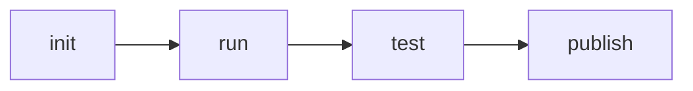
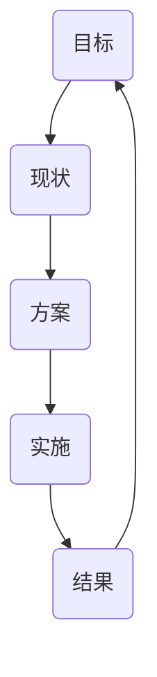

# 工程体系(课上)
## 职业规划
## 职业发展
### 成就
> 业务型成就
* 业务目标
  * 理解公司业务的核心目标
  * 目标转化为指标
* 技术方案
  * 业务指标到技术指标的转化
  * 形成直面方案、完成小规模实验
* 实施方案
  * 确定实施目标、参与人
  * 管理实施进度
* 结果评估
  * 数据采集、数据报表
  * 向上级汇报
> 技术难题
* 目标
  * 公认的技术难点
* 方案与实施
  * 依靠扎实的编程能力、架构能力形成解决方案
* 结果
  * 线上监控

> 工程型成就
* 目标
  * 质量、效率
* 方案与实施
    * 规章制度
    * 库
    * 工具
    * 系统
* 结果
  * 线上监控

> 工具链
  * 工具链作用
  * 工具链分类
    * 脚手架
    * 本地调试
    * 单元测试
    * 发布
  * 工具链体系的设计
    * 版本问题
    * 数据统计

> 持续集成
* 客户端软件持续集成
  * Daily Build
  * BVT (Build Verification Test)
* 前端持续集成
  * Check-in build
  * Lint + Rule Check

> 技术架构
* 客户端架构：解决软件需求规模带来的复杂性
* 服务端架构：解决大量用户访问带来的复杂性
* 前端架构：大量页面需求带来的重复劳动问题
  * 库：有复用价值的代码
    * URL(RFC)
    * AJAX
    * ENV
  * 组件：UI上多次出现的元素
  * 模块：经常被使用的业务模块
    * 登录

tab+手势
爬取价格
xss攻击的预防

数据驱动

### 晋升

### 成长 